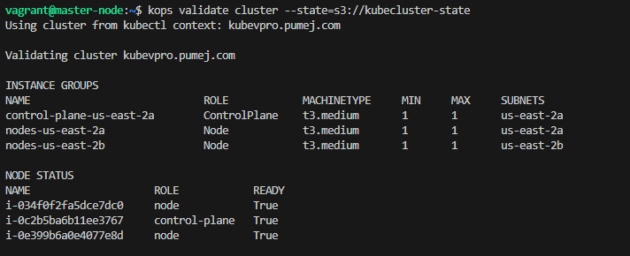
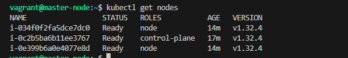
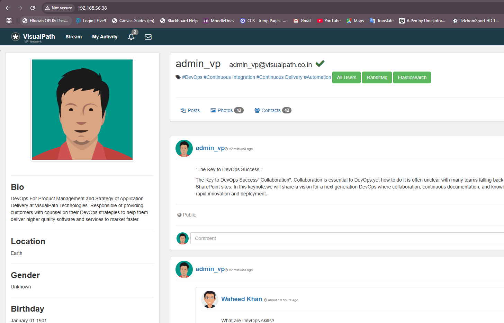

## This is a Kubernetes set up for local development and production set up using vagrant and kops dependencies

    - This project shows how to set up K8 cluster 
    - Also deploys manifests files for the Vprofile java application

## Set up for Local testing 

- For Local set up we would be usin minikube, install minikube and kubectl CLI using below command 

    ```bash
    Set-ExecutionPolicy Bypass -Scope Process -Force; [System.Net.ServicePointManager]::SecurityProtocol = [System.Net.ServicePointManager]::SecurityProtocol -bor 3072; iex ((New-Object System.Net.WebClient).DownloadString('https://chocolatey.org/install.ps1'))
    choco install minikube kubernetes-cli -y
    minikube start                                  | This starts the local kube cluster on a single node 
    cat .kube/config                                | Used to view the config file for the cluster 
    ```

## Set up for- production using 3 VMs, One master node and 2 worker nodes 

    - Provision the nodes both master and worker nodes using Vagrant with all ubuntu image 
    - Log onto master node as root user 
    - Install Docker engine on all Nodes 
    - Install kubeadm, kubectl, and kubelet on all Nodes 
    - Initialize keube on master node 
        ```bash
        kubeadm init 
        ```
    - Save the node join command to be used on worker nodes. This command would be returned by master node 
    - Execute the returned kube join command on worker nodes 
    - Execute user data script for master node 
    - Log into worker node as regular user and execute command

## Set up using Kops and a VM either provisioned in cloud or using Vagrant 

    - Must have a registered domain with a provider, mine is pumej.com with ionos. Also create a sub-domain kubevpro.pumej.com.
    - Create an S3 bucket for managing the state of Kops 
    - Create a NS using the Value/Route traffic to from AWS Route 53, after creating a hosted zone in Route 53. My hosted zone was kubevpro.pumej.com
    - Spin up the VM or an EC2 instance using Vagrant or terraform.
    - Install required dependencies for the set up, use below commands:

        ```bash
        vagrant.exe ssh                             | Used to log into the provisioned VM
        ssh-keygen                                  | Used to generate public key for the VM. This key would be pushed to all instances on the cluster. 
        apt-get install -y awscli                   | Used to install aws-cli which is required. You can also add this as part of the start up script for your VM or EC2 instance. 
        aws configure                               | Used to set up aws profile, provide your access key and secret key 
        nslookup -type=ns kubevpro.pumej.com        | Used to look up your domain
        dig NS kubevpro.pumej.com                   | Would also return the added NS from route 53. 
        ```

    - Install kubectl using below commands: 

        ```bash
        curl -LO "https://dl.k8s.io/release/$(curl -L -s https://dl.k8s.io/release/stable.txt)/bin/linux/amd64/kubectl"
        sudo install -o root -g root -m 0755 kubectl /usr/local/bin/kubectl
        kubectl version --client
        ---

    - Install Kops using the below commands: 

        ```bash
        curl -Lo kops https://github.com/kubernetes/kops/releases/download/$(curl -s https://api.github.com/repos/kubernetes/kops/releases/latest | grep tag_name | cut -d '"' -f 4)/kops-linux-amd64
        chmod +x kops
        sudo mv kops /usr/local/bin/kops
        ```

    - Now we can run the Kops command which would create the cluster. Use the below command and ensure your bucket is created already 

        ```bash
        export KOPS_CLUSTER_NAME=kubevpro.pumej.com
        export KOPS_STATE_STORE=s3://kubecluster-state

        kops create cluster \
            --name=$KOPS_CLUSTER_NAME \
            --state=$KOPS_STATE_STORE \
            --zones=us-east-2a,us-east-2b \
            --node-count=2 \
            --node-size=t3.medium \
            --control-plane-size=t3.medium \
            --dns-zone=$KOPS_CLUSTER_NAME \
            --yes
        ```
    - This would provision the Cluster - 1 VPC, 3 EC 2 instances for the nodes, Auto scaling groups, 2 SG, 1 Internet gateway, Subnets, 5 Volumes, route-tables etc for both master and worker nodes
    - It would also update your DNS provider with the public IP address of the master node. 
    - You can validate the cluster using below Kops command:

        ```bash
        kops validate cluster --state-s3://kubecluster-state                            | Used to validate the cluster 
        ssh -i ~/.ssh/id_rsa ubuntu@api.kubevpro.pumej.com                              | Used to log into the nodes 
        kubectl get nodes                                                               | Used to get nodes 
        ```





## Delete the entire set up 

    - Use the below command to delete the cluster 

        ```bash
        kops delete cluster --name=kubevpro.pumej.com --state=s3://kubecluster-state --yes    | Used to delete the entire cluster provisioned resources. 
        ```

## Set up using AWS EKS service. 

    - This involves using AWS eks service utility to set up your cluster. This would do same as what the Kops cammand did but this time in the cloud. 
    - You only need to have awscli installed on your local PC and a profile configured with the right access. 
    - Use the below command for the set up of the cluster 

        ```bash
        CLUSTER_NAME=vprofile-eks-cluster
        REGION=us-east-2
        NODE_NAME=Linux-nodes
        KEY_NAME=vprofile-eks-key

        eksctl create cluster \
            --name $CLUSTER_NAME \
            --version 1.20 \
            --region $REGION \
            --nodegroup-name $NODE_NAME \
            --nodes 2 \
            --nodes-min 1 \
            --nodes-max 4 \
            --node-type t3.micro \
            --node-volume-size 8 \
            --ssh-access \
            --ssh-public-key $KEY_NAME \
            --managed
        ```

## Set up Docker files for the backend services and run below command to build images 

    - We using a docker-compose.yml file at the root of repository to bring up all containers for the project. 

    ```bash
    docker-compose build --no-cache 
    docker compose up  -d 
    ```
- Applications should now be accessible on your VMs IP address. You should be able to log in correctly to access the application 



## Now you can push your images to your dockerhub account successfully 
    
    - The below command is for a private ECR repository

    ```bash
    aws ecr create-repository --repository-name vprofile-repo --region us-east-1                                                     | Used to create private repo                            
    docker build -t imageName:v1 .                                                                                                                  | Used to build imageName:v1
    aws ecr get-login-password --region us-east-1 | docker login --username AWS --password-stdin 598189530267.dkr.ecr.us-east-1.amazonaws.com       | Used to auth to ECR
    docker tag imageName:latest 598189530267.dkr.ecr.us-east-1.amazonaws.com/vprofile-repo:latest                                                   | Tag the image first 
    docker push 598189530267.dkr.ecr.us-east-1.amazonaws.com/vprofile-repo:latest                                                                   | Used to push image to remote repo. 
    ```

    ```bash
    aws ecr-public create-repository --repository-name vprofile-repo --region us-east-1                                    | Used to create an aws public repository
    docker build -t vprofile-repo .                                                                                        | Used to build imageName:tag
    docker tag imageName:latest public.ecr.aws/p9c7s9q0/vprofile-repo:tag                                                  | Used to tag built image before pushing 
    aws ecr-public get-login-password --region us-east-1 | docker login --username AWS --password-stdin public.ecr.aws/p9c7s9q0         | Log in command 
    docker push public.ecr.aws/p9c7s9q0/vprofile-repo:tag                                                                  | Used to push image to your public repo   
    ```
## Deploying the Java application to your cluster

    - Provision your cluster using any of the above methods. Here I would provision mine using ansible using the shell script at root of the project directory. 
    - Once provisioned confirm access to the cluster using the kubectl commands 
    - Deploy your manifests to the cluster using below commands in the sequence below: First deploy the backend resources 

        - Create manifests files, secrets, db deployment file, 

        ```bash
        echo -n "vprodbpass" | base64                                       | Used to encode the secrets when creating secrets file. 
        kubectl create -f kubernetes/vpro-app                               | Used to deploy all the manifests 
        kubectl get svc                                                     | To get the cluster IP for accessing your application.
        ```

    - You can access your application on the cluster ip since we deployed this using a locally deployed cluster

Enjoy!!! Thanks. 